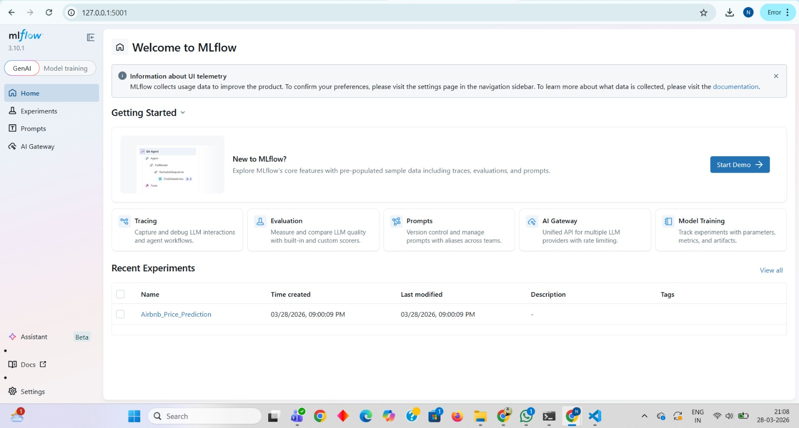
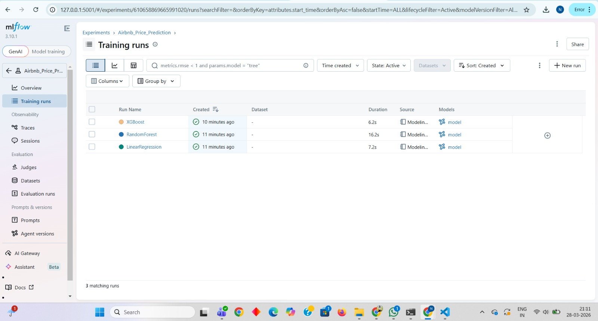
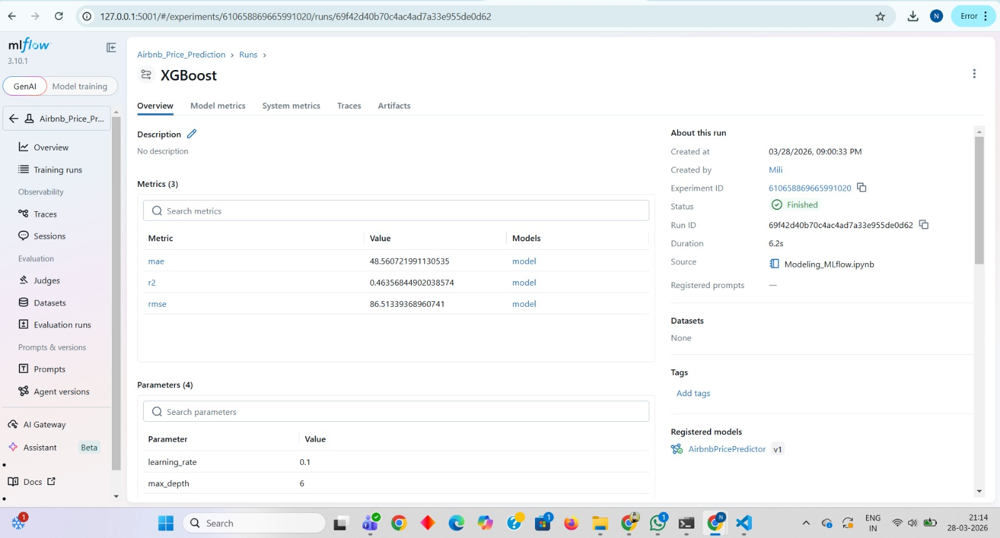
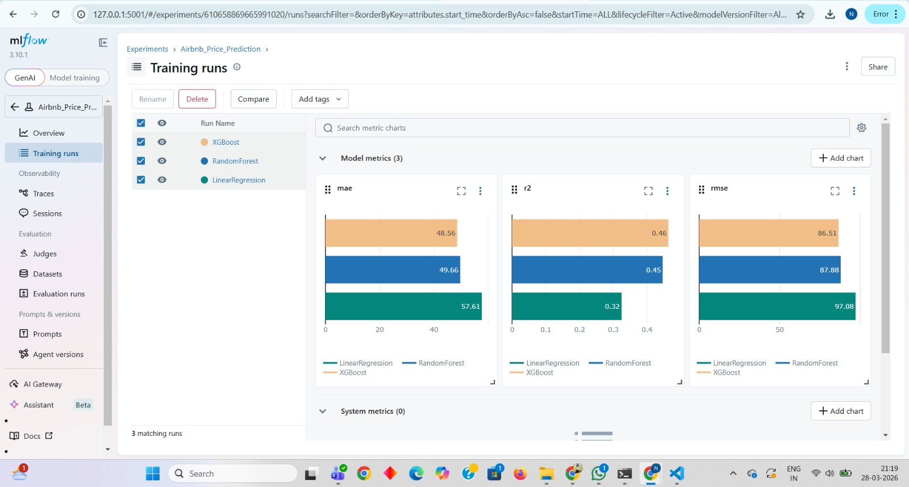

# Airbnb NYC Listing Price Prediction

## Project Overview
This project is developed as part of the StayWise Data Science team assignment. The goal is to build a machine learning pipeline that predicts the optimal nightly price for Airbnb listings in New York City based on factors such as location, room type, and reviews.

## Objectives
- Retrieve the Airbnb listings dataset from AWS S3
- Perform end-to-end data preprocessing and feature engineering
- Develop and compare multiple regression models
- Track all experiments using MLflow and register the best model

---

## Dataset
- **Source:** AWS S3 — `s3://staywise-airbnb-mjayani/airbnb/raw_data/listings.csv`
- **Original Size:** 48,895 rows × 16 columns
- **After Cleaning:** 48,645 rows × 16 columns
- **Target Variable:** `price` (nightly listing price in USD)

---

## Repository Structure
```
airbnb-price-prediction/
│
├── data/                         # Local data files (gitignored)
│   ├── listings_raw.csv
│   └── listings_clean.csv
│
├── notebooks/
│   ├── data_ingestion.ipynb      # Load data from AWS S3
│   ├── EDA_Preprocessing.ipynb   # Data cleaning & feature engineering
│   └── Modeling_MLflow.ipynb     # Model training & MLflow tracking
│
├── screenshots/                  # MLflow UI screenshots
├── mlruns/                       # MLflow run artifacts (gitignored)
├── .gitignore
├── requirements.txt
└── README.md
```

---

## Setup Instructions

### 1. Clone the Repository
```bash
git clone https://github.com/yourusername/airbnb-price-prediction.git
cd airbnb-price-prediction
```

### 2. Install Dependencies
```bash
pip install -r requirements.txt
```

### 3. Configure AWS Credentials
```bash
aws configure
```
Enter your AWS Access Key ID, Secret Access Key, region (`us-east-2`), and output format (`json`).

### 4. Run Notebooks in Order
```
1. notebooks/data_ingestion.ipynb
2. notebooks/EDA_Preprocessing.ipynb
3. notebooks/Modeling_MLflow.ipynb
```

### 5. Launch MLflow UI
```bash
cd notebooks
mlflow ui --backend-store-uri ./mlruns --port 5001
```
Open `http://127.0.0.1:5001` in your browser.

---

## Data Preprocessing Steps
- Removed listings with `price = 0` (invalid) and `price > 1000` (outliers)
- Filled missing `reviews_per_month` with 0
- Created `has_reviews` binary feature
- Dropped non-predictive columns: `id`, `name`, `host_id`, `host_name`, `last_review`
- One-hot encoded `neighbourhood_group` and `room_type`

---

## Models Compared

| Model | RMSE | MAE | R2 |
|---|---|---|---|
| Linear Regression | 97.08 | 57.61 | 0.32 |
| Random Forest | 87.88 | 49.66 | 0.45 |
| **XGBoost** | **86.51** | **48.56** | **0.46** |

**Best Model: XGBoost** — registered as `AirbnbPricePredictor v1` in MLflow Model Registry.

---

## MLflow Experiment Tracking

### Experiment Runs


### Metrics Comparison


### XGBoost Run Details


### Model Registry


---

## Key Insights
- **XGBoost** outperformed all models with the lowest RMSE (86.51) and highest R2 (0.46)
- **Room type** and **neighbourhood group** are the strongest price predictors
- **Manhattan** listings are significantly more expensive than other boroughs
- Listings with **no reviews** tend to have more variable pricing
- **Entire home/apt** listings command the highest prices on average

---

## Technologies Used
- **Python** — pandas, numpy, scikit-learn, xgboost
- **AWS S3** — cloud dataset storage via boto3
- **MLflow** — experiment tracking and model registry
- **Jupyter Notebook** — development environment
- **VS Code** — IDE

---

## Author
M_Jayani  
Assignment 03 — StayWise Data Science Project